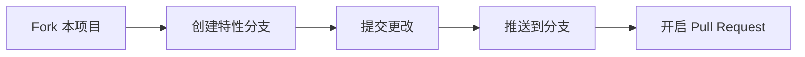

# 【德美颜】AI增长架构师 / DeMeiYan AI Growth Architect

<div align="center">


**一个专为创业者和医美行业打造的AI驱动产品增长助手**

**An AI-powered growth architecture assistant for entrepreneurs and medical aesthetics professionals**

[English](#english) | [中文](#中文)

</div>

## 🚀 Live Demo / 在线演示

<div align="center">

**立即体验 Try it now:** 

**[https://streamlit-ai-assistant-xuanxuanchen198.replit.app](https://streamlit-ai-assistant-xuanxuanchen198.replit.app)**

</div>

---

## 中文

### 📖 项目简介

【德美颜】AI增长架构师是一个基于Streamlit的AI驱动应用程序，旨在帮助创业者和医美行业从业者识别真实的市场需求、验证商业想法并跟踪增长实验。

通过专业的AI代理团队，从需求洞察到产品上市和营销推广，全流程智能化支持您的业务增长。

---

### ✨ 核心功能

<table>
<tr>
<td width="50%">

#### 🎯 需求洞察引擎

- **需求雷达Agent**  
  分析市场需求，识别真实痛点

- **用户画像建模Agent**  
  提取用户痛点，创建精准用户画像

- **文件上传支持**  
  支持上传调研报告（.txt, .md, .pdf, .docx）

#### 📊 精益复盘中心

- **数据罗盘Agent**  
  指导MVP实验，记录和分析结果

- **实验跟踪**  
  全面的数据持久化和历史对比

</td>
<td width="50%">

#### 🤝 AI团队协作中心

五位专业AI经理提供全方位支持：

- **产品经理** · SSR框架战略报告
- **市场经理** · 营销策略与品牌传播
- **医学经理** · 医学可信度与合规审查
- **新媒体经理** · 全平台内容策略
- **设计经理** · 品牌视觉解决方案

#### 📈 数据看板

- 📊 可视化需求分析趋势
- 👥 用户画像分布统计  
- ✅ MVP实验成功率分析

</td>
</tr>
</table>

#### 🌐 中英文双语支持

> 完整的界面翻译系统 · AI输出支持简体中文、繁体中文、English · 运行时动态切换，无需刷新

#### 💾 全面的数据持久化

> PostgreSQL数据库存储所有分析结果 · 支持历史记录查询和对比 · 分页浏览历史数据

#### 📄 报告导出

> Markdown格式 · PDF格式（完整中文字符支持）

---

### 🎨 设计特色

<table>
<tr>
<td align="center" width="25%">
<b>🌌 深色主题</b><br/>
紫蓝渐变背景<br/>
<code>#7e5bff → #00c7ff</code>
</td>
<td align="center" width="25%">
<b>💎 玻璃态设计</b><br/>
现代化的<br/>
玻璃态卡片
</td>
<td align="center" width="25%">
<b>✨ 发光效果</b><br/>
边框发光与<br/>
悬停动画
</td>
<td align="center" width="25%">
<b>🎬 流畅动画</b><br/>
cubic-bezier<br/>
缓动函数
</td>
</tr>
</table>

---

### 🛠 技术栈

| 类别 | 技术 |
|------|------|
| **前端框架** | Streamlit |
| **AI服务** | Google Gemini API (gemini-2.5-flash) |
| **数据库** | PostgreSQL |
| **数据可视化** | Plotly |
| **PDF生成** | FPDF2（支持中文） |
| **包管理器** | uv |

---

### 📦 依赖包

```toml
[project.dependencies]
streamlit
google-genai
psycopg2-binary
plotly
fpdf2
pypdf
python-docx
```

### 🚀 快速开始

<details>
<summary><b>📋 点击展开完整安装步骤</b></summary>

<br/>

#### 1️⃣ 环境准备

> ⚠️ 确保您已安装 **Python 3.11** 或更高版本

#### 2️⃣ 克隆项目

```bash
git clone https://github.com/xuanxuan1983/Demeiyan-ai-growth-architect.git
cd Demeiyan-ai-growth-architect
```

#### 3️⃣ 安装依赖

使用 **uv**（推荐）：
```bash
uv pip install -e .
```

或使用 **pip**：
```bash
pip install streamlit google-genai psycopg2-binary plotly fpdf2 pypdf python-docx
```

#### 4️⃣ 配置环境变量

创建 `.env` 文件或在 Replit Secrets 中设置：

```bash
GEMINI_API_KEY=your_gemini_api_key_here
DATABASE_URL=your_postgresql_database_url_here
```

> 💡 **获取API密钥：** [Google Gemini API](https://ai.google.dev/)

#### 5️⃣ 初始化数据库

首次运行时，应用程序会自动创建所需的数据库表：

| 表名 | 说明 |
|------|------|
| `demand_analysis` | 需求分析记录 |
| `user_persona` | 用户画像记录 |
| `mvp_experiment` | MVP实验记录 |

#### 6️⃣ 运行应用

```bash
streamlit run app.py --server.port 5000
```

> 🎉 访问 `http://localhost:5000` 即可使用应用

</details>

### 📂 项目结构

<table>
<tr>
<td width="50%">

#### 核心文件

| 文件 | 说明 |
|------|------|
| 📱 `app.py` | 主应用程序（163KB）<br/>包含所有UI和AI Agent逻辑 |
| 🗄️ `database.py` | 数据库操作模块<br/>PostgreSQL连接和查询 |
| 📦 `pyproject.toml` | 项目依赖配置<br/>所有Python包声明 |
| 📖 `README.md` | 项目文档（本文件） |
| 📋 `replit.md` | 技术架构文档 |

</td>
<td width="50%">

#### 配置和资源

| 目录/文件 | 说明 |
|----------|------|
| ⚙️ `.streamlit/` | Streamlit配置目录 |
| └─ `config.toml` | 主题、端口等配置 |
| 🔤 `fonts/` | 字体资源目录 |
| └─ `华文中宋.ttf` | 中文字体（PDF导出） |
| 🚫 `.gitignore` | Git忽略规则 |
| 📄 `LICENSE` | MIT开源许可证 |

</td>
</tr>
</table>

<details>
<summary><b>📦 完整目录树结构</b></summary>

```
Demeiyan-ai-growth-architect/
│
├── 📱 app.py                      # Streamlit主应用（163KB）
│                                   # ├─ 翻译系统
│                                   # ├─ 需求洞察引擎
│                                   # ├─ 精益复盘中心
│                                   # ├─ AI团队协作中心
│                                   # └─ 数据看板
│
├── 🗄️ database.py                 # 数据库模块
│                                   # ├─ 连接管理（重试机制）
│                                   # ├─ 表创建和查询
│                                   # └─ 数据持久化
│
├── ⚙️ .streamlit/
│   └── config.toml                # Streamlit配置
│                                   # ├─ 服务器设置（port 5000）
│                                   # └─ 深色主题配置
│
├── 🔤 fonts/
│   └── 华文中宋.ttf                # 中文字体（PDF导出）
│
├── 📦 pyproject.toml              # 依赖声明
│                                   # ├─ streamlit >= 1.50.0
│                                   # ├─ google-genai >= 1.48.0
│                                   # └─ 其他核心包
│
├── 🚫 .gitignore                  # Git忽略规则
├── 📄 LICENSE                     # MIT许可证
├── 📖 README.md                   # 项目文档（本文件）
└── 📋 replit.md                   # 技术架构文档
```

</details>

### 🔧 主要配置

#### Streamlit配置 (.streamlit/config.toml)

```toml
[server]
port = 5000
address = "0.0.0.0"
headless = true

[theme]
base = "dark"
primaryColor = "#9D7EFF"
backgroundColor = "#0A0B1E"
secondaryBackgroundColor = "#1A1B3D"
textColor = "#E8E9F3"
```

---

### 💡 使用指南

| 步骤 | 操作说明 |
|------|---------|
| **1. 选择语言** | 在侧边栏顶部选择您偏好的语言（简体中文/English） |
| **2. 需求洞察** | 输入产品概念或上传调研报告，使用需求雷达Agent和用户画像Agent分析 |
| **3. 精益复盘** | 记录MVP实验数据，使用数据罗盘Agent获取AI复盘建议 |
| **4. AI团队协作** | 填写项目信息，选择AI经理，获取专业策略报告 |
| **5. 查看历史** | 浏览所有历史分析记录，支持分页查询 |
| **6. 数据看板** | 可视化查看趋势和统计数据 |
| **7. 导出报告** | 下载Markdown或PDF格式报告 |

---

### 🔐 安全提示

> ⚠️ **切勿提交API密钥到代码仓库** - 始终使用环境变量或Secrets管理  
> 🔒 **数据库连接** - 确保DATABASE_URL配置正确且安全  
> 🚀 **生产部署** - 建议使用Replit的内置发布功能或其他专业托管服务

---

### 🤝 贡献指南

欢迎贡献代码、报告问题或提出新功能建议！



1. **Fork** 本项目
2. **创建**您的特性分支 `git checkout -b feature/AmazingFeature`
3. **提交**您的更改 `git commit -m 'Add some AmazingFeature'`
4. **推送**到分支 `git push origin feature/AmazingFeature`
5. **开启** Pull Request

### 📝 许可证

本项目采用 MIT 许可证 - 查看 [LICENSE](LICENSE) 文件了解详情

### 📧 联系方式

<div align="center">

如有问题或建议，欢迎通过以下方式联系：

[](https://github.com/xuanxuan1983/Demeiyan-ai-growth-architect/issues)
[](https://github.com/xuanxuan1983/Demeiyan-ai-growth-architect)
[](mailto:xuan.xuan.chen1983@gmail.com)

**📮 邮箱：** xuan.xuan.chen1983@gmail.com

</div>

---

## English

### 📖 Project Overview

DeMeiYan AI Growth Architect is a Streamlit-based AI-driven application designed to help entrepreneurs and medical aesthetics professionals identify genuine market needs, validate business ideas, and track growth experiments. With a team of specialized AI agents, it provides intelligent support throughout your business growth journey—from demand insights to product launch and marketing.

### ✨ Key Features

#### 🎯 Demand Insight Engine
- **Demand Radar Agent**: Analyzes market demand and identifies real pain points
- **User Persona Modeling Agent**: Extracts user pain points and creates precise personas
- **File Upload Support**: Upload research reports (.txt, .md, .pdf, .docx) for deep analysis

#### 📊 Lean Retrospective Center
- **Data Compass Agent**: Guides MVP experimentation and analyzes results
- **Experiment Tracking**: Comprehensive experiment data persistence and historical comparison

#### 🤝 AI Team Collaboration Center
Five professional AI managers providing comprehensive support:
- **Product Manager Agent**: Generates product strategy reports (SSR framework)
- **Marketing Manager Agent**: Develops marketing strategies and brand communication plans
- **Medical Manager Agent**: Provides medical credibility and compliance review
- **Social Media Manager Agent**: Creates content strategies for major platforms (XiaoHongShu, Instagram, TikTok, Weibo, Bilibili, Zhihu, WeChat)
- **Design Manager Agent**: Recommends brand visual solutions and design strategies

#### 📈 Data Dashboard
- Visualize demand analysis trends
- User persona distribution statistics
- MVP experiment success rate analysis

#### 🌐 Bilingual Support
- Complete interface translation system
- AI output supports Simplified Chinese, Traditional Chinese, and English
- Dynamic language switching without page refresh

#### 💾 Comprehensive Data Persistence
- PostgreSQL database for all analysis results
- Historical query and comparison support
- Paginated browsing of historical data

#### 📄 Report Export
- Markdown format export
- PDF format export (full Chinese character support)

### 🎨 Design Features

- **Dark Theme**: Professional purple-blue gradient background (#7e5bff to #00c7ff)
- **Glassmorphism Design**: Modern glass-effect cards and containers
- **Glow Effects**: Elegant border glows and hover animations
- **Smooth Animations**: Interactive animations with cubic-bezier easing

### 🛠 Tech Stack

- **Frontend Framework**: Streamlit
- **AI Service**: Google Gemini API (gemini-2.5-flash)
- **Database**: PostgreSQL
- **Data Visualization**: Plotly
- **PDF Generation**: FPDF2 (with Chinese support)
- **Package Manager**: uv

### 📦 Dependencies

```toml
[project.dependencies]
streamlit
google-genai
psycopg2-binary
plotly
fpdf2
pypdf
python-docx
```

### 🚀 Quick Start

#### 1. Prerequisites

Ensure you have Python 3.11 or higher installed.

#### 2. Clone the Repository

```bash
git clone https://github.com/xuanxuan1983/Demeiyan-ai-growth-architect.git
cd Demeiyan-ai-growth-architect
```

#### 3. Install Dependencies

Using uv (recommended):
```bash
uv pip install -e .
```

Or using pip:
```bash
pip install streamlit google-genai psycopg2-binary plotly fpdf2 pypdf python-docx
```

#### 4. Configure Environment Variables

Create a `.env` file or set in Replit Secrets:

```bash
GEMINI_API_KEY=your_gemini_api_key_here
DATABASE_URL=your_postgresql_database_url_here
```

**Obtain API Keys:**
- Google Gemini API: [https://ai.google.dev/](https://ai.google.dev/)

#### 5. Initialize Database

On first run, the application will automatically create required database tables:
- `demand_analysis`: Demand analysis records
- `user_persona`: User persona records
- `mvp_experiment`: MVP experiment records

#### 6. Run the Application

```bash
streamlit run app.py --server.port 5000
```

Visit `http://localhost:5000` to use the application.

### 📂 Project Structure

```
.
├── app.py                 # Main application file
├── database.py            # Database operations module
├── .streamlit/
│   └── config.toml        # Streamlit configuration
├── fonts/
│   └── 华文中宋.ttf        # Chinese font (for PDF export)
├── pyproject.toml         # Project dependencies
├── replit.md              # Technical documentation
└── README.md              # This file
```

### 🔧 Main Configuration

#### Streamlit Configuration (.streamlit/config.toml)

```toml
[server]
port = 5000
address = "0.0.0.0"
headless = true

[theme]
base = "dark"
primaryColor = "#9D7EFF"
backgroundColor = "#0A0B1E"
secondaryBackgroundColor = "#1A1B3D"
textColor = "#E8E9F3"
```

### 💡 User Guide

1. **Select Language**: Choose your preferred language (简体中文/English) in the sidebar

2. **Demand Insights**:
   - Enter your product concept or upload research reports
   - Use Demand Radar Agent to analyze market demand
   - Use User Persona Agent to create precise user personas

3. **Lean Retrospective**:
   - Record your MVP experiment data
   - Get AI-powered retrospective insights with Data Compass Agent

4. **AI Team Collaboration**:
   - Fill in project overview information
   - Select the AI manager you want to consult
   - Receive professional strategy reports

5. **View History**:
   - Browse all historical analysis records
   - Supports paginated queries

6. **Data Dashboard**:
   - Visualize trends and statistics

7. **Export Reports**:
   - Click export buttons to download Markdown or PDF reports

### 🔐 Security Tips

- **Never commit API keys to repository**: Always use environment variables or Secrets
- **Database Connection**: Ensure DATABASE_URL is configured correctly and securely
- **Production Deployment**: Recommended to use Replit's built-in publishing or other professional hosting services

### 🤝 Contributing

Contributions, issues, and feature requests are welcome!

1. Fork the project
2. Create your feature branch (`git checkout -b feature/AmazingFeature`)
3. Commit your changes (`git commit -m 'Add some AmazingFeature'`)
4. Push to the branch (`git push origin feature/AmazingFeature`)
5. Open a Pull Request

### 📝 License

This project is licensed under the MIT License - see the [LICENSE](LICENSE) file for details

### 📧 Contact

<div align="center">

For questions or suggestions, please contact:

[](https://github.com/xuanxuan1983/Demeiyan-ai-growth-architect/issues)
[](https://github.com/xuanxuan1983/Demeiyan-ai-growth-architect)
[](mailto:xuan.xuan.chen1983@gmail.com)

**📮 Email:** xuan.xuan.chen1983@gmail.com

</div>

---

<div align="center">

**Made with ❤️ for entrepreneurs and growth professionals**

**为创业者和增长专业人士用心打造**

</div>
